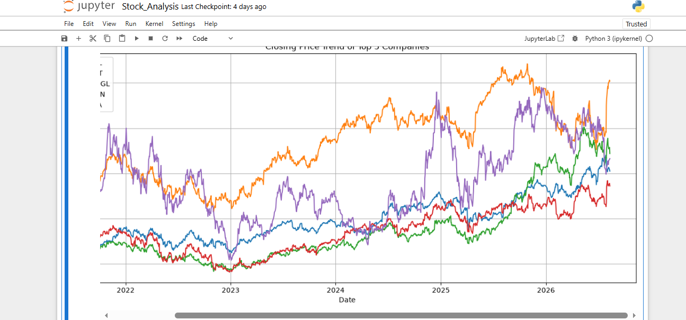
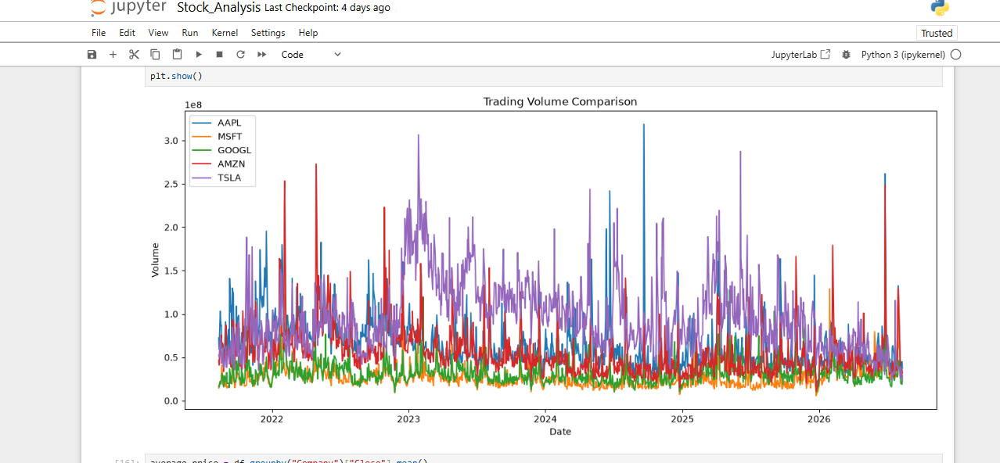
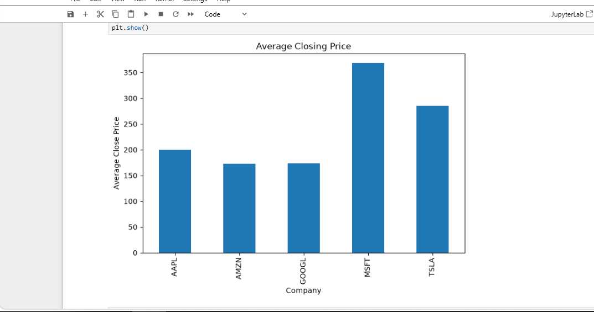
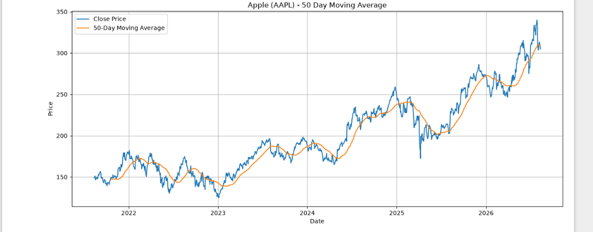
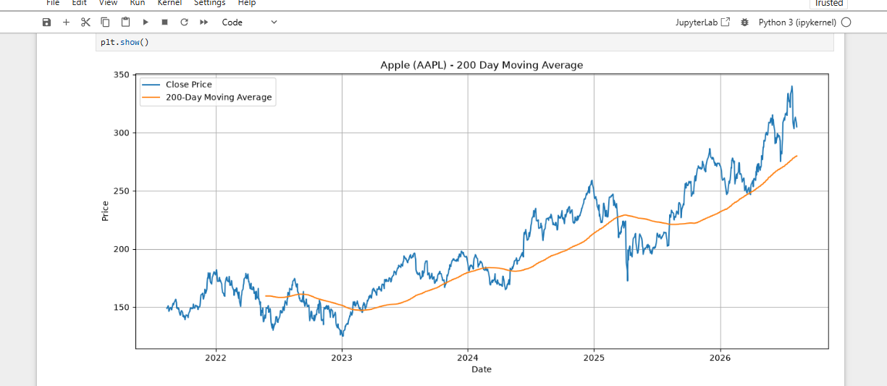
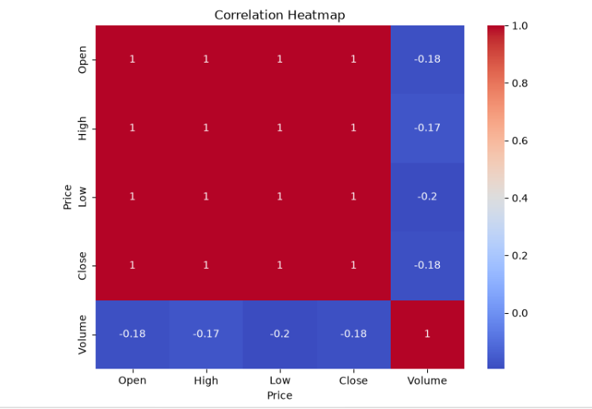
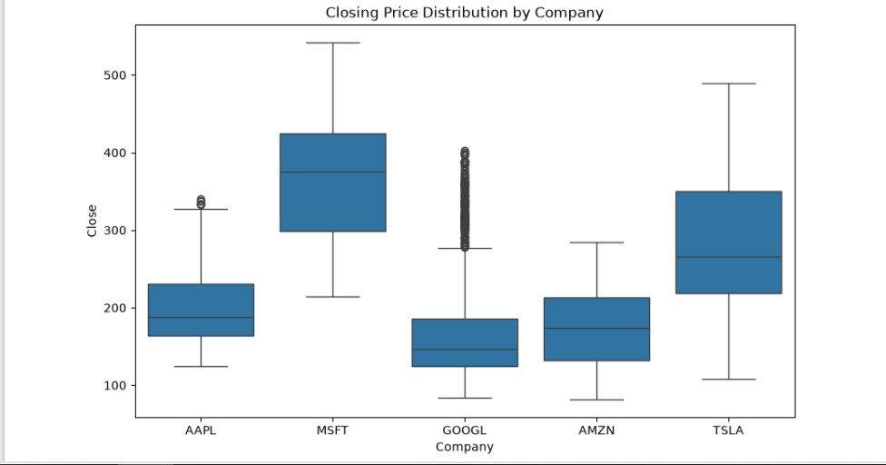
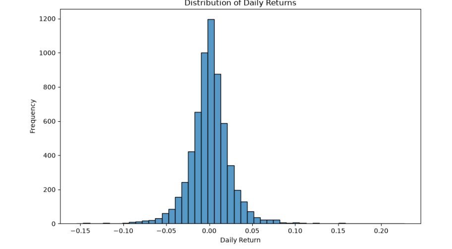
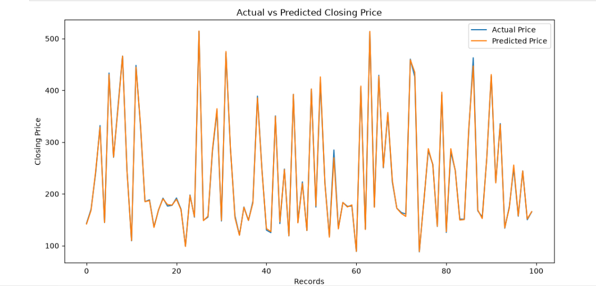
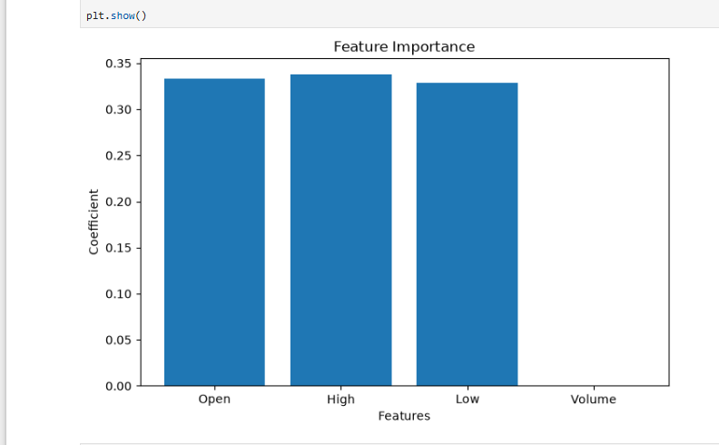

# 📈 Stock Market Analysis 

> **An end-to-end Python project for analyzing historical stock-market data, discovering trends, performing statistical analysis, visualizing technical indicators, and predicting closing prices using Machine Learning.**

This project analyzes historical data for five major technology companies:

**AAPL (Apple) • MSFT (Microsoft) • GOOGL (Google) • AMZN (Amazon) • TSLA (Tesla)**

The analysis is implemented in **Python using Jupyter Notebook** and combines Exploratory Data Analysis (EDA), statistical analysis, technical indicators, visualization, and a **Linear Regression** model for closing-price prediction.

---

## 🎯 Project Objective

The main objective of this project is to understand historical stock-market behavior and build a simple machine-learning workflow for predicting stock closing prices.

The project focuses on:

- 📊 Historical stock-price analysis
- 📈 Trend and volatility analysis
- 📉 Trading-volume analysis
- 📌 Average closing-price comparison
- 📐 Moving-average analysis
- 🔥 Correlation analysis
- 📦 Price-distribution analysis
- 📊 Daily-return analysis
- 🤖 Closing-price prediction using Linear Regression
- 🎯 Actual vs. predicted price comparison
- 🔎 Feature coefficient analysis

---

## 🧰 Tech Stack

| Technology / Library | Usage |
|---|---|
| **Python** | Core programming and analysis |
| **Pandas** | Data cleaning, transformation and analysis |
| **NumPy** | Numerical operations |
| **Matplotlib** | Data visualization |
| **Seaborn** | Statistical visualization |
| **Scikit-learn** | Machine Learning and Linear Regression |
| **Jupyter Notebook** | Development and experimentation |
| **CSV** | Input historical data and prediction output |

---

## 📂 Project Structure

```text
Stock-Market-Analysis/
│
├── data/
│   └── stock_data.csv
│
├── logs/
│   └── project.log
│
├── notebook/
│   ├── Stock_Analysis.ipynb
│   └── Untitled.ipynb
│
├── reports/
│   └── predictions.csv
│
├── README.md
│
├── 01_closing_price_trend.png
├── 02_trading_volume_comparison.png
├── 03_average_closing_price.png
├── 04_aapl_50_day_moving_average.png
├── 05_aapl_200_day_moving_average.png
├── 06_correlation_heatmap.png
├── 07_closing_price_distribution.png
├── 08_daily_returns_distribution.png
├── 09_actual_vs_predicted.png
└── 10_linear_regression_coefficients.png
```

---

# 🔬 Project Workflow

```text
Historical Stock Data
        │
        ▼
Data Loading & Preparation
        │
        ▼
Data Cleaning & Exploration
        │
        ▼
Exploratory Data Analysis
        │
        ├── Price Trend Analysis
        ├── Volume Analysis
        ├── Average Price Analysis
        ├── Distribution Analysis
        └── Correlation Analysis
        │
        ▼
Technical Analysis
        │
        ├── 50-Day Moving Average
        └── 200-Day Moving Average
        │
        ▼
Feature Selection
        │
        ▼
Train/Test Split
        │
        ▼
Linear Regression Model
        │
        ▼
Closing Price Prediction
        │
        ▼
Actual vs Predicted Analysis
        │
        ▼
Feature Coefficient Visualization
```

---

# 📊 Exploratory Data Analysis

## 1. Closing Price Trend of Top 5 Companies

The project compares the historical closing-price movement of Apple, Microsoft, Google, Amazon and Tesla.

<p align="center">
  
</p>

### What this visualization provides

- Long-term price movement comparison
- Identification of major upward and downward movements
- Visual comparison of price volatility
- Understanding of how different companies behaved over the analyzed period

---

## 2. Trading Volume Comparison

Trading volume is analyzed to understand the level of market activity for each company.

<p align="center">
  
</p>

### Why trading volume matters

Trading volume indicates how actively a stock is being traded. Large volume spikes can highlight periods of unusually high market activity.

---

## 3. Average Closing Price

The average historical closing price is calculated and compared across the five companies.

<p align="center">
  
</p>

This provides a simple numerical comparison of the average closing-price level for each analyzed company.

---

# 📐 Technical Analysis

## 4. Apple — 50-Day Moving Average

The project calculates Apple's 50-day moving average and compares it with the actual closing price.

<p align="center">
  
</p>

### Purpose

A moving average smooths short-term price fluctuations and makes the underlying price trend easier to observe.

---

## 5. Apple — 200-Day Moving Average

The project also calculates Apple's 200-day moving average to analyze the longer-term price trend.

<p align="center">
  
</p>

### 50-Day vs 200-Day Moving Average

| Indicator | Purpose |
|---|---|
| **50-Day MA** | Helps observe a shorter/intermediate-term trend |
| **200-Day MA** | Helps observe a longer-term trend |

---

# 📊 Statistical Analysis

## 6. Correlation Heatmap

The project analyzes the correlation between:

- Open
- High
- Low
- Close
- Volume

<p align="center">
  
</p>

### Why correlation analysis is useful

Correlation helps understand the relationship between numerical variables and can support feature-selection decisions before applying a machine-learning model.

---

## 7. Closing Price Distribution by Company

A boxplot is used to compare the distribution of closing prices for the five companies.

<p align="center">
  
</p>

The boxplot helps visualize:

- Median
- Spread
- Variability
- Range
- Potential outliers

---

## 8. Distribution of Daily Returns

Daily returns are analyzed to understand the distribution of day-to-day price changes.

<p align="center">
  
</p>

### Daily Return

A daily return represents the percentage change in price from one trading day to the next.

The distribution helps visualize the typical range of daily movements and unusually large positive or negative returns.

---

# 🤖 Machine Learning

## 9. Closing Price Prediction

The project uses **Linear Regression** to build a simple predictive model for closing prices.

Selected input features include:

- **Open**
- **High**
- **Low**
- **Volume**

The data is divided into training and testing sets using `train_test_split`, after which the Linear Regression model is trained and used to generate predictions.

---

## 10. Actual vs Predicted Closing Price

The model's predictions are compared visually with the actual closing prices.

<p align="center">
  
</p>

### Purpose

This visualization provides an intuitive way to see how closely the model's predictions follow the observed closing-price values.

> **Note:** The model is intended as an educational demonstration of a machine-learning workflow and is not a production-grade stock forecasting system.

---

# 🔎 Feature Coefficients

## Linear Regression Coefficients

The project visualizes the coefficients associated with the selected features.

<p align="center">
  
</p>

The coefficient visualization helps interpret the relative contribution of the model's input features.

---

# 🧠 Key Concepts Demonstrated

### Python & Data Analysis
- DataFrames
- Data cleaning and transformation
- Grouping and aggregation
- Sorting and filtering
- Statistical calculations

### Visualization
- Line charts
- Bar charts
- Boxplots
- Histograms
- Heatmaps

### Financial / Time-Series Concepts
- Closing price
- Trading volume
- Daily returns
- Moving averages
- Price distributions
- Correlation

### Machine Learning
- Feature selection
- Train/test split
- Supervised learning
- Linear Regression
- Prediction
- Model interpretation through coefficients

---

# 📁 Generated Output

The project produces a prediction file:

```text
reports/predictions.csv
```

The Jupyter Notebook contains the complete analysis workflow and generated visualizations.

---

# ▶️ How to Run the Project

## 1. Clone the repository

```bash
git clone https://github.com/Just-Muskan12/Stock-Market-Analysis.git
```

## 2. Open the project

```bash
cd Stock-Market-Analysis
```

## 3. Install required libraries

```bash
pip install pandas numpy matplotlib seaborn scikit-learn jupyter
```

## 4. Launch Jupyter Notebook

```bash
jupyter notebook
```

## 5. Open the main notebook

```text
notebook/Stock_Analysis.ipynb
```

Run the notebook cells sequentially to reproduce the analysis.

---

# 📌 Key Project Highlights

✨ Analyzed **5 major technology companies**

✨ Performed **exploratory data analysis** on historical stock data

✨ Compared **closing prices and trading volumes**

✨ Implemented **50-day and 200-day moving averages**

✨ Performed **correlation and distribution analysis**

✨ Calculated and analyzed **daily returns**

✨ Built a **Linear Regression model**

✨ Generated **closing-price predictions**

✨ Compared **actual vs predicted values**

✨ Visualized **model feature coefficients**

✨ Organized prediction output into a separate reports folder

✨ Maintained project execution logs

---

# 📚 Learning Outcomes

Through this project, I gained practical experience in:

- Working with real-world financial datasets
- Cleaning and analyzing structured data
- Creating meaningful data visualizations
- Understanding basic time-series indicators
- Performing statistical analysis
- Preparing data for machine learning
- Building and interpreting a regression model
- Presenting analytical results through a reproducible Jupyter Notebook

---

# ⚠️ Disclaimer

This project is developed **for educational and analytical purposes only**.

Stock-market data is volatile, and machine-learning predictions cannot guarantee future market performance. The results of this project should **not be considered financial or investment advice**.

---

# 👩‍💻 Author

## Muskan 

**MCA | Python | Data Analysis | SQL | Machine Learning**

---

⭐ **If you found this project useful, consider giving the repository a Star!**
